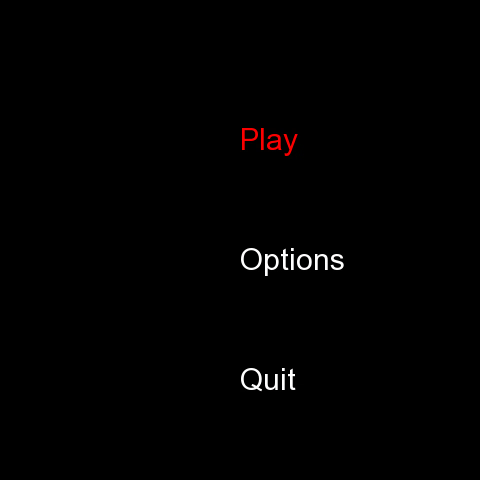

# SnakeSFML

SnakeSFML is a Snake game developed in C++. 

SnakeSFML uses SFML which is a simple, fast, cross-platform multimedia API.

It provides access to windowing, graphics, audio and network.

Will you be able to beat the hard mode ? (Beating hard mode, is actually attaining maximum snake length ;) ) 

Have fun :)! 



### Requirements
In order to compile this code, you'll need SFML installed. A quick way to do it on linux (debian based): 

  ```sudo apt install libsfml-dev```
  
### Install

Simply type : 
``` make ```

or if you're reckless and want to compile it by hand :
```g++ -c include/*.hpp src/*.cpp && g++ *.o -o snake -lsfml-graphics -lsfml-window -lsfml-system -lsfml-audio && ./snake ```


### Perspectives

* Add online scoreboard
* Multiplayer Snake (multiple snakes race to eat the fruit !) 
